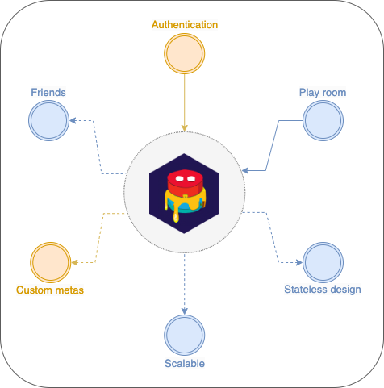

# Yummy Game Server

 
 

 

**Yummy** is the multiplayer game engine to make it easier to develop game. Supports websocket communication to give wider range of the platform. Web, Android, Ios, desktop and all modern browser have inbuild websocket support and **Yummy** can be used almost all platforms.
Our main goal of the developing this application is support game developer to make better games. Most of the time developing multiplayer games are more complicated than the single player games and with **Yummy** some of the difficulties can be solved more easier.

**Yummy Game Engine** give developers central communication between players. Players can build their own friend list, create new room for game, send message to room or even directly to users. Also, up coming new features will make **Yummy** more delicious. 

 

  

  

## 🚀 Some features:
- Communicates over WebSocket
- Multiple authentication support
- Different kind of room creation settings
- Stateless design to make easily scale horizontally
- Support for custom TLS certificates
  

## 📕 Documentation
Please follow to [documentation](https://erhanbaris.github.io/yummy/)
  

## 🚧 Note
**Yummy** still under development and there are too many missing feature. But, we are heavy working on integrating all necessary feature. There is a documentation about how to connect and use but some informations still missing. Feel free to ask question and create pull request and we will be happy to see your feedback.
