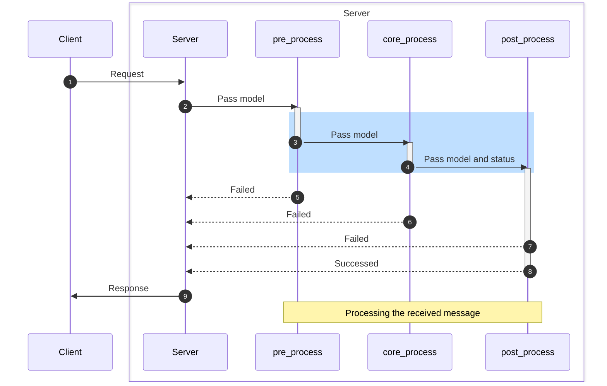

# Python Scripting

**Yummy** has *Python Programming Language* support. You can control the flow via Python scripts and it is very easy to write. All **Auth** module can be controlled over Python and the system has default Python script to start modification. **Yummy** will have more robust Python support but for now, we have limited support. Also, all Python scripts are stateful, it means that if you change variable at runtime, it will change that variable for all other requests. 

**Yummy** scan all available Python files and import into the system. You should configure `DEFAULT_PYTHON_FILES_PATH` parameter to change default path.
You should check `yummy-server/py/reference.py` files see all available API's.

Also, there is example about how to use Python to control flow and logic. Please check a look at the `examples/tic-tac-toe` from the repository.


### WARNING
There is a one critical issue can be impect your Python implementation.

**Never save/assign *Model* to Python list/dict/variable.** That will impect **Yummy** stability and the system will **CRASH** at first request. But, nice thing is that you will get information about why it is crashed and clearly, you can read that problem at logs.

Here is the one the example for **DO NOT DO THIS**.

```python
messages = {}

def pre_email_auth(model):
    messages.pre_auth = model
    pass

def post_email_auth(model, successed):
    messages.post_auth = model
    pass
```

### Execution flow


1. **Client** send message to **Server**.
2. **Server** will pass received model to **pre_process** operation. That is the python function what we customized. We can update the model and updated model will be passed to **core_process**. This stage mostly used for validating model or updating it. Lets says, you dont want to use clients value and force to use your value, you can update model. Like, maximum size of the room. 
3. **core_process** receive the message from **pre_process** function and execute internal logics. The system can send message to some other clients.
4. When **core_process** finish internal execution, the system call **post_process** python function. But, in this case, the system pass two parameter instead of one. First argument is model, seconds argument is **core_process** status. If the some information is missing or there is a issue, second argument will be **False**. But, if everything is normal and as expected, parameter will be **True**. This stage mostly used to finilize checks or logics. Like, if the client send a message to room and we want to update room metadata, we should check the status variable and update room metadata.
5. Flow can be stopped at **pre_process** stage. Maybe code is not valid or intentionally flow needs to be stopped. You can use **fail()** function to do that.
6. Flow can be stopped at **core_process** stage.
7. Flow can be stopped at **post_process** stage. Maybe code is not valid or intentionally flow needs to be stopped. You can use **fail()** function to do that.
8. If the everything went well, the system response message(s) to **Server**.
9. **Server** will send message to **Client**.


### TODOS

- [ ] Database access
- [ ] Stateless access
